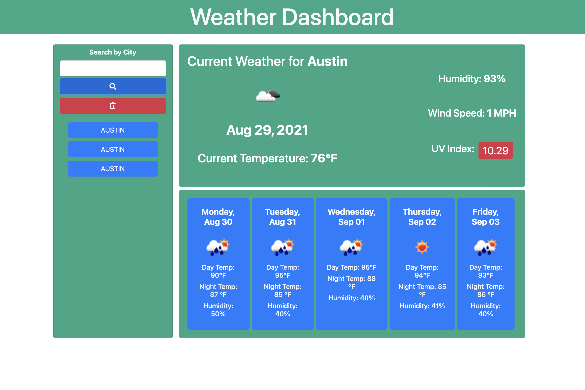

# Weather app 

Designed by Maria Villarreal

 

## Getting Started
You may use this app by clicking on the github link below. 
- https://msvillarreal21.github.io/weathersearch/

## Prerequisites 
You will need a code editing software to be able to download and save this code. VS code was used to create this app. 

## Summary 
This is a weather dashboard app. The user may click on the search bar and type in a city they would like to search. Once they have made their selection the user will see a five day weather forecast for that city. The cities that have been searched will be added below the seach bar. 

## File types:
- Html : to link javascript and holds basic infomation for browser to display

- Css : to design the page.

- Javascript- to run the app. 